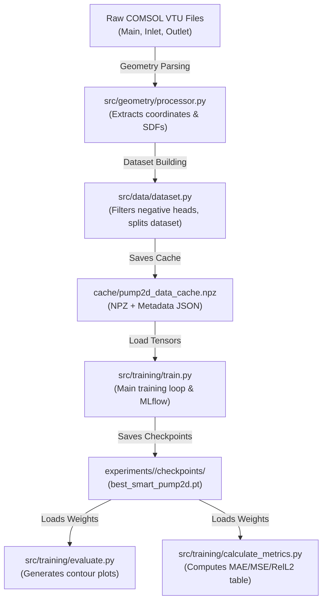

# SMART 2D Pump Surrogate Project Architecture

This document provides a comprehensive overview of the architecture, data pipeline, file roles, caching structure, and history of the [`pump2d_smart`](file:///home/vpspepe/Documents/TUD/HiWi/Ecotwin/POC_Tests/pump2d_smart) project.

---

## 1. Directory Structure

The project is structured under [`POC_Tests/pump2d_smart/`](file:///home/vpspepe/Documents/TUD/HiWi/Ecotwin/POC_Tests/pump2d_smart) as follows:

```text
pump2d_smart/
├── conf/                          # Nested Hydra configuration hierarchy
│   ├── config.yaml                # Master configuration entry point
│   ├── model/                     # SMART complexity (smart_small.yaml, smart_base.yaml)
│   ├── training/                  # Batch size, epochs, device, hardware limits
│   ├── optimizer/                 # Adam, AdamW
│   ├── lr_scheduler/              # ReduceLROnPlateau, CosineAnnealing, Exponential, None
│   ├── early_stopping/            # Patience, delta, mode
│   ├── features/                  # Surface prediction & selective SDF toggles
│   ├── loss/                      # RelL2, MSE, physics-informed penalty terms
│   ├── data/                      # Paths, test splits, caching
│   └── tracking/                  # MLflow experiment tracking
├── cache/                         # Default cache folder (empty, populated during training)
├── cache_test/                    # Test cache folder containing sample pre-processed data
├── experiments/                   # Isolated experiment artifacts, plots, and checkpoints
├── src/
│   ├── data/
│   │   ├── dataset.py             # PyTorch dataset, data normalizer, and loader
│   │   └── utils.py               # Preprocessing utilities (Kennard-Stone)
│   ├── geometry/
│   │   └── processor.py           # Surface contour extractor, ray-caster & SDFs
│   ├── loss/
│   │   ├── losses.py              # Loss criteria (MSE, L1, RelL2Loss, CombinedLoss)
│   │   └── physics_losses.py      # ECOTWIN Physics losses (L_mass, L_wall, L_flux, L_outlet_p)
│   └── training/
│       ├── calculate_metrics.py   # Validation error metrics (MSE, MAE, RelL1, RelL2, R2)
│       ├── calculate_pump_heads.py# Physics library (line integrals, head equations)
│       ├── config.py              # Structured dataclasses and Hydra config loader
│       ├── early_stopping.py      # OOP early stopping monitor and best model saver
│       ├── evaluate.py            # Matplotlib contour plotting for predictions
│       ├── experiment_manager.py  # Isolated experiment manager and H-Q split plotter
│       ├── feature_manager.py     # Selective SDF extraction and surface mode routing
│       ├── lr_scheduler.py        # Factory for ReduceLROnPlateau, Cosine, Exponential
│       ├── metrics.py             # Vectorized R2, RelL1, RelL2, MAE, MSE calculator
│       ├── plotting.py            # Visualization library (H-Q curves, contours, loss curves)
│       └── train.py               # MLflow training manager and fit loop
└── README_architecture.md         # This documentation
```

---

## 2. File-by-File Description

### Data & Physics
*   **[`src/data/dataset.py`](file:///home/vpspepe/Documents/TUD/HiWi/Ecotwin/POC_Tests/pump2d_smart/src/data/dataset.py):**
    Implements `Pump2DDataset` (subclass of PyTorch `Dataset`). Orchestrates loading raw VTU grids from COMSOL, parsing parameters (RPM and flow rate $Q_{in}$), mapping nodes, dividing training/validation splits using the Kennard-Stone space-filling metric, Z-score standardization, and cache generation.
*   **[`src/training/calculate_pump_heads.py`](file:///home/vpspepe/Documents/TUD/HiWi/Ecotwin/POC_Tests/pump2d_smart/src/training/calculate_pump_heads.py):**
    Central library containing CFD numerical integration functions. Exposes:
    *   `extract_unique_edges`: Safely parses boundary edges from mesh cell arrays.
    *   `line_integral`: Computes the trapezoidal line integral of field variables over boundary coordinates.
    *   `compute_pump_head`: Calculates the average total pressure difference ($\Delta P_t$) and physical head ($H$) between the inlet and outlet boundaries.

### Geometry & Features
*   **[`src/geometry/processor.py`](file:///home/vpspepe/Documents/TUD/HiWi/Ecotwin/POC_Tests/pump2d_smart/src/geometry/processor.py):**
    Extracts unified pump boundaries (Open Casing + 7 Blades + Inlet), provides GPU ray-casting (`is_inside_polygon_pytorch`) for fluid domain point validation, and pre-computes Signed Distance Fields (SDFs).
*   **[`src/training/feature_manager.py`](file:///home/vpspepe/Documents/TUD/HiWi/Ecotwin/POC_Tests/pump2d_smart/src/training/feature_manager.py):**
    Encapsulates selective feature routing: enables/disables surface predictions, and selectively extracts active SDF feature channels (`use_sdf_blades`, `use_sdf_mrf`) with dynamic dimension adjustment.

### Training & Orchestration
*   **[`src/training/config.py`](file:///home/vpspepe/Documents/TUD/HiWi/Ecotwin/POC_Tests/pump2d_smart/src/training/config.py):**
    Defines structured Python dataclasses corresponding to Hydra config groups and provides safe configuration loading.
*   **[`src/training/lr_scheduler.py`](file:///home/vpspepe/Documents/TUD/HiWi/Ecotwin/POC_Tests/pump2d_smart/src/training/lr_scheduler.py):**
    Factory for learning rate schedulers (`ReduceLROnPlateau`, `CosineAnnealingLR`, `ExponentialLR`, `None`).
*   **[`src/training/early_stopping.py`](file:///home/vpspepe/Documents/TUD/HiWi/Ecotwin/POC_Tests/pump2d_smart/src/training/early_stopping.py):**
    Monitors validation improvements, tracks patience, and automatically caches best checkpoint weights.
*   **[`src/training/metrics.py`](file:///home/vpspepe/Documents/TUD/HiWi/Ecotwin/POC_Tests/pump2d_smart/src/training/metrics.py):**
    Computes physical evaluation metrics ($R^2$ score, Relative $L_1$, Relative $L_2$, MAE, MSE).
*   **[`src/training/plotting.py`](file:///home/vpspepe/Documents/TUD/HiWi/Ecotwin/POC_Tests/pump2d_smart/src/training/plotting.py):**
    Dedicated visualization library for generating H-Q data split graphs, loss progression curves, flow field comparison contours, and predicted vs CFD H-Q performance curves.
*   **[`src/training/train.py`](file:///home/vpspepe/Documents/TUD/HiWi/Ecotwin/POC_Tests/pump2d_smart/src/training/train.py):**
    Contains `Pump2DTrainer`. Integrates Hydra configurations, MLflow tracking, parameter count logging, training loops, validation evaluation, automated figure generation, and early stopping.
*   **[`src/training/experiment_manager.py`](file:///home/vpspepe/Documents/TUD/HiWi/Ecotwin/POC_Tests/pump2d_smart/src/training/experiment_manager.py):**
    Structures training runs under isolated directories (`experiments/<exp_name>/plots/`, `experiments/<exp_name>/checkpoints/`), stores active settings to `config.json`, and logs all artifacts/checkpoints to MLflow.
*   **[`src/training/evaluate.py`](file:///home/vpspepe/Documents/TUD/HiWi/Ecotwin/POC_Tests/pump2d_smart/src/training/evaluate.py):**
    Loads checkpoint weights, runs inference on a validation operating point, de-normalizes predictions, and delegates 3-panel contour rendering to `plotting.py`.
*   **[`src/training/calculate_metrics.py`](file:///home/vpspepe/Documents/TUD/HiWi/Ecotwin/POC_Tests/pump2d_smart/src/training/calculate_metrics.py):**
    Loops over all validation samples to compute quantitative errors (MSE, MAE, Rel L1, Rel L2, and $R^2$) across the predicted fields and displays them in a Markdown summary table.
*   **[`src/loss/losses.py`](file:///home/vpspepe/Documents/TUD/HiWi/Ecotwin/POC_Tests/pump2d_smart/src/loss/losses.py):**
    Provides custom composite losses (e.g. `CombinedLoss`, `RelL2Loss`) combining surface and volume criteria.
*   **[`src/loss/physics_losses.py`](file:///home/vpspepe/Documents/TUD/HiWi/Ecotwin/POC_Tests/pump2d_smart/src/loss/physics_losses.py):**
    Implements ECOTWIN physics-informed differentiable loss terms: divergence-free mass conservation ($L_{\text{mass}}$), no-slip / rotating wall boundary conditions ($L_{\text{BC, wall}}$), global inlet/outlet mass flux continuity ($L_{\text{flux}}$), and outlet reference pressure anchoring ($L_{\text{BC, out}}$).

---

## 3. Data Pipeline & Execution Flow

The following sequence details how raw mesh geometries are transformed into trained surrogate evaluations:



> [!NOTE]
> Physical variables (parameters and targets) are normalized using **Z-score standardization** ($\mu = 0, \sigma = 1$) during dataset preprocessing, and then mapped back to their original physical units ($Pa, m/s$) before computing metric tables or plotting contours.

---

## 4. Cache Format

To speed up model initialization, pre-processed coordinates and targets are saved to a compressed `.npz` archive along with a companion `.json` file for structural transparency.

### The NPZ Archive (`pump2d_data_cache.npz`)
*   `geometry`: Shape `(N_samples, 821, 2)` — full unified pump geometry (Open Casing: 97 pts + 7 Impeller Blades: 595 pts + Inlet: 129 pts).
*   `surface_coords`: Shape `(N_samples, 821, 2)` — coordinates of the full pump surface boundary (Open Casing + 7 Blades + Inlet).
*   `surface_data`: Shape `(N_samples, 821, 1)` — normalized surface pressure across the full pump boundary.
*   `volume_coords`: Shape `(N_samples, 5577, 2)` — coordinates of the volume fluid grid.
*   `volume_extra`: Shape `(N_samples, 5577, 2)` — pre-computed SDFs (Channel 0: to blades, Channel 1: to MRF zone).
*   `volume_data`: Shape `(N_samples, 5577, 3)` — normalized target flow fields ($p, v_x, v_y$).
*   `params`: Shape `(N_samples, 2)` — operating parameters ($Q_{in}, \text{RPM}$).
*   `triangles`: Shape `(N_triangles, 3)` — triangular cell connectivity array.
*   `boundary_norm_in` / `boundary_norm_out`: Shape `(12, 2)` — precomputed outward unit normals for inlet/outlet flux integrals.
*   `boundary_weights_in` / `boundary_weights_out`: Shape `(12,)` — precomputed segment lengths ($dl$) for numerical line integration.
*   `boundary_idx_in` / `boundary_idx_out`: Volume grid mapped indices for inlet (12 pts) and outlet (13 pts).

---

## 5. Execution Modes & Configuration

The training and evaluation pipeline supports **config-driven mode selection**:
*   **Volume-Only Mode (`surface_channels = 0`):**
    *   Encoder receives full 821-point pump geometry.
    *   Decoder queries exclusively volume coordinates (`volume_coords`, 5,577 points) and pre-computed SDFs (`volume_extra`).
    *   Bypasses surface queries without allocating dummy zero-padding tensors.
    *   Loss is computed strictly on volume targets ($p, v_x, v_y$).
*   **Joint Surface + Volume Mode (`surface_channels > 0`):**
    *   Queries both blade surface pressure and internal volume fields simultaneously.

---

## 6. Refactoring History & Optimizations

*   **Centralized Physics Calculations:** Removed duplicate integrations from `data/dataset.py` and `training/experiment_manager.py`. All line integrations, boundary mappings, and head equations are now consolidated into [`training/calculate_pump_heads.py`](file:///home/vpspepe/Documents/TUD/HiWi/Ecotwin/POC_Tests/pump2d_smart/training/calculate_pump_heads.py).
*   **Decoupled Modules (Circular Import Fix):** Modified `calculate_pump_heads.py` to be a pure functions library without importing `data.dataset` or `config.py` at runtime.
*   **Purged Path Hacks:** Removed dynamic `sys.path.append` and `sys.path.insert` statements from all code files, enforcing clean imports relative to python's standard paths.
*   **Isolated Workspace Outputs:** Removed all automatic copy-back procedures to the `.gemini/` hidden folders. All training assets, plots, and models are now cleanly grouped under local directories (`experiments/` and `results/`).
*   **Library Pattern Enforced:** Removed all executable `if __name__ == "__main__":` runner blocks from trainer, dataset, evaluation, and metrics files to ensure all files act as pure importable libraries.
*   **Space-Filling Dataset Splitting:** Replaced interleaved/random validation splits with the **Kennard-Stone space-filling algorithm** evaluated on the standardized operating point parameters ($Q_{in}$, RPM), optimizing feature space coverage.
*   **Modular Trainer Private Methods:** Deconstructed the `Pump2DTrainer` constructor and `fit()` loop into cohesive, single-responsibility private helper methods (`_init_hardware_and_seeds`, `_init_data_loaders`, `_init_model`, `_init_optimizer_and_scheduler`, `_init_loss_function`, `_step_lr_scheduler`, `_step_early_stopping`, `_generate_post_training_evaluation`).
*   **Improvement-Only Checkpointing Policy:** Removed redundant unconditional epoch checkpointing (`checkpoint_last.pt`). Model weights (`best_smart_pump2d.pt`) are now written to disk strictly and exclusively when the monitored loss/validation metric enhances.
*   **Graceful Ctrl+C (KeyboardInterrupt) Handling:** The training loop safely intercepts `KeyboardInterrupt`, preventing abrupt termination or dangling MLflow runs, and immediately proceeds to generate post-training evaluation plots and upload artifacts.

