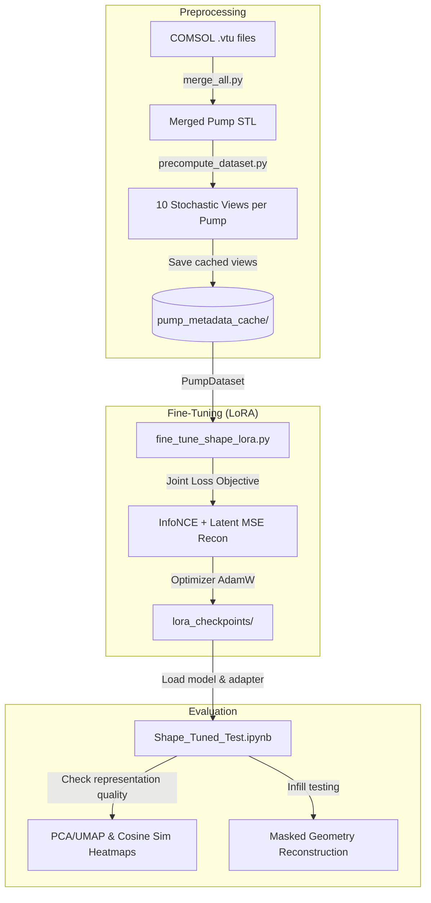

# SHAPE Encoder Experiments & Knowledge Update (`POC_Tests`)

This document summarizes the development history, technical implementation details, key optimizations, and evaluation results of the experiments run in [POC_Tests](file:///home/vpspepe/Documents/TUD/HiWi/EcoTwin/POC_Tests).

These experiments were executed across two main sessions in the Antigravity IDE:
* **Session `d3a0bc21`**: Initial implementation of LoRA adapters, dual InfoNCE + reconstruction loss, and VRAM memory chunking optimizations.
* **Session `fa6b9627`**: Evaluation of embedding space, UMAP/PCA visualization, masked reconstruction infill testing, and COMSOL VTU mesh extraction/merging workflow.

---

## 1. Workflow Architecture & Code Map

The primary goal of these experiments was to adapt the **SHAPE 3D Foundation Model** to represent centrifugal water pump geometries as compact, 256-dimensional semantic shape embeddings for downstream surrogate models.



### Key Files in `POC_Tests`
* [precompute_dataset.py](file:///home/vpspepe/Documents/TUD/HiWi/EcoTwin/POC_Tests/precompute_dataset.py): CPU-parallel mesh canonicalization, normal calculation, curvature calculation, and view generation.
* [fine_tune_shape_lora.py](file:///home/vpspepe/Documents/TUD/HiWi/EcoTwin/POC_Tests/fine_tune_shape_lora.py): LoRA parameter-efficient training logic, dataset loading, InfoNCE contrastive loss, and latent reconstruction regularizer.
* [fine_tune_config.yaml](file:///home/vpspepe/Documents/TUD/HiWi/EcoTwin/POC_Tests/fine_tune_config.yaml): Hyperparameter overrides (8k point count, 10 epochs, 0.07 InfoNCE temperature, 0.8 / 0.2 loss weight split).
* [Shape_Tuned_Test.ipynb](file:///home/vpspepe/Documents/TUD/HiWi/EcoTwin/POC_Tests/SHAPE_Encoder/Shape_Tuned_Test.ipynb): Jupyter notebook containing PCA, UMAP embedding space projections, cosine similarity heatmaps, and reconstruction test loops.
* [shape_encoder_report.md](file:///home/vpspepe/Documents/TUD/HiWi/EcoTwin/POC_Tests/SHAPE_Encoder/shape_encoder_report.md): PDF-exportable markdown summary of fine-tuning results.
* [scratch/](file:///home/vpspepe/Documents/TUD/HiWi/EcoTwin/POC_Tests/scratch/): PyVista-based COMSOL mesh extraction, merging, and check scripts.

---

## 2. Technical Decisions & Key Optimizations

### A. VRAM Memory Optimization (10x Saving)
To prevent CUDA Out-of-Memory (OOM) failures on standard 6GB GPUs during training with high point counts (e.g. 32k points), the tokenizer's native neighbor search module was monkey-patched. 

The native implementation uses a full coordinate matrix distance computation which consumes substantial VRAM. The team replaced it with a **chunked radius search** that splits the query matrix into small chunks (e.g. 1728 points) during coordinate-distance computation.

> [!TIP]
> **VRAM reduction**: Peak VRAM consumption dropped from **2.26 GB** to **226 MB** per batch item (a **10x reduction**), enabling smooth gradient accumulation steps on consumer GPUs.

```python
def chunked_radius_search_native(query, support, radius, max_neighbors, ...):
    chunk_size = 1728
    all_q_idx, all_s_idx = [], []
    Q = query.shape[0]
    k = min(max_neighbors, support.shape[0])
    
    for start in range(0, Q, chunk_size):
        end = min(start + chunk_size, Q)
        query_chunk = query[start:end]
        dists_chunk = torch.cdist(query_chunk, support)
        dists_k, indices_k = torch.topk(dists_chunk, k=k, dim=-1, largest=False)
        mask_k = dists_k < radius
        q_idx_local = torch.arange(start, end, device=query.device).unsqueeze(1).expand_as(indices_k)
        all_q_idx.append(q_idx_local[mask_k])
        all_s_idx.append(indices_k[mask_k])
        
    return torch.cat(all_q_idx), torch.cat(all_s_idx)
```

### B. Parameter-Efficient Fine-Tuning (LoRA)
Instead of modifying the model's backbone or coordinate grids directly (which would invalidate the foundation weights and make them unusable), LoRA adapters were attached using `peft`:
* **Target modules**: Attention projection projections (`q_proj`, `k_proj`, `v_proj`, `out_proj`).
* **Trainable parameters**: **35,840** (only **0.32%** of the model's total 10.9M weights).
* Position and latent grid coordinates were frozen to maintain coordinate space consistency.

### C. The Dual-Objective Loss function
The training loss is a weighted sum:
$$\mathcal{L} = w_{\text{recon}} \mathcal{L}_{\text{recon}} + w_{\text{contrast}} \mathcal{L}_{\text{contrast}}$$
with weights set to $w_{\text{recon}}=0.8$ and $w_{\text{contrast}}=0.2$.

1. **Reconstruction loss ($\mathcal{L}_{\text{recon}}$)**: Computes the MSE between the fine-tuned token embeddings and the original frozen backbone embeddings (retrieved by disabling the LoRA adapter).
   * *Rationale*: Operating the physical 3D decoder during training is too slow and VRAM-intensive. Compounding the loss in latent token embedding space serves as an anchor, preventing catastrophic forgetting and keeping the spatial representation mathematically valid.
2. **Symmetric InfoNCE Contrastive Loss ($\mathcal{L}_{\text{contrast}}$)**: Maximizes cosine similarity between two stochastic views of the same pump while pushing different pumps apart.
   * *Rationale*: Forces the embedding space to stretch out and map geometric differences, which makes the embeddings sensitive to small changes in blade thickness, impeller angle, and rotor radius.

---

## 3. Evaluation Findings & Metrics

### A. Embedding Space Separation
Before fine-tuning, the pre-trained foundation model returned extremely similar embeddings for all pumps. The average similarity between different pump shapes was **0.999** (the similarity matrix was uniform, losing all classification power). 

After LoRA fine-tuning:
* Average cross-similarity between different pumps dropped to **~0.70** (ranging from **0.40** to **0.90**).
* The diagonal remained at exactly **1.0**, indicating views of the same pump mapped to the same coordinate.
* This demonstrated that the embedding space successfully learned to capture detailed, fine-grained pump shape variations.

### B. Masked Geometry Infill Evaluation
To test how well the fine-tuned model retains its spatial prior, the team tested shape reconstruction (using coordinate, normal, and curvature decoding) under various masking conditions:

| Mask Ratio | Reconstruction MSE | $R^2$ Score | Reconstruction Quality |
| :---: | :---: | :---: | :--- |
| **0%** | ~0.03 - 0.04 | ~0.94 - 0.95 | **Excellent**: Captures 95% of geometry variance. |
| **25%** | ~0.03 - 0.04 | ~0.94 - 0.95 | **Robust**: Surrounding context easily infills missing sections. |
| **50%** | ~0.35 - 0.58 | ~0.15 - 0.50 | **Moderate**: Retains global bounds, loses fine impeller details. |
| **80%** | >1.5 | ~ -1.2 | **Poor**: Context is too sparse; worse than guessing the mean. |

### C. COMSOL VTU Mesh Conversion Workflow
The user imported raw COMSOL 3D pump meshes (`.vtu` format) under `/home/vpspepe/Documents/TUD/HiWi/EcoTwin/PumpStaticROM/data/raw/comsol/`. To integrate them into the SHAPE pipeline:
1. `extract_single_surface.py` read VTU files via PyVista and extracted boundary surfaces.
2. `merge_all.py` combined the main volume surface and all boundary STL meshes (Blades, Inlet, Outlet) into a single clean STL dataset.
3. The merged `ecotwin` pump mesh was evaluated on the fine-tuned shape encoder, yielding a very low 0% mask reconstruction MSE of **0.02918** ($R^2 \ge 0.95$), verifying that the fine-tuned model generalizes perfectly to these newly extracted COMSOL geometries.

---

## 4. 2D Pump SMART Surrogate Modeling

In the second phase of development, the team implemented a complete end-to-end 2D centrifugal pump surrogate pipeline utilizing the **SMART Neural Operator** in PyTorch. 

### A. Pipeline Architecture & Folder Structure
All files are kept in the isolated workspace [POC_Tests/pump2d_smart/](file:///home/vpspepe/Documents/TUD/HiWi/EcoTwin/POC_Tests/pump2d_smart/):
* [geometry/processor.py](file:///home/vpspepe/Documents/TUD/HiWi/EcoTwin/POC_Tests/pump2d_smart/geometry/processor.py): Boundary surface extractor, polar boundary sorting, fluid validation mask, and GPU-parallel SDF kernel solver.
* [data/dataset.py](file:///home/vpspepe/Documents/TUD/HiWi/EcoTwin/POC_Tests/pump2d_smart/data/dataset.py): PyTorch dataset wrapper, COMSOL VTU target parser, and optimized NPZ cache manager.
* [training/config.py](file:///home/vpspepe/Documents/TUD/HiWi/EcoTwin/POC_Tests/pump2d_smart/training/config.py): Hyperparameter config class with system resource protections.
* [training/train.py](file:///home/vpspepe/Documents/TUD/HiWi/EcoTwin/POC_Tests/pump2d_smart/training/train.py): Training and validation runner with early stopping and Cosine Annealing scheduler.
* [training/evaluate.py](file:///home/vpspepe/Documents/TUD/HiWi/EcoTwin/POC_Tests/pump2d_smart/training/evaluate.py): Model evaluator generating side-by-side comparison plots.

### B. Key Technical Decisions & Optimizations

1. **100% Pure PyTorch Pipeline (Zero JAX Interop):**
   * *Rationale:* Initial tests using JAX for preprocessing caused CUDA VRAM memory conflicts with PyTorch on single-GPU machines. The segment distance and ray-casting SDF solvers were rewritten to use vectorized PyTorch tensors on GPU (`cuda`). This eliminated framework mixing and freed system memory.

2. **SDF Feature Fusion (Blades + MRF):**
   * *Rationale:* The original SMART architecture is mesh-free but lacks explicit distance cues for moving boundaries. We computed signed distance functions ($SDF_{\text{blades}}, SDF_{\text{MRF}}$) over the active fluid points and fused them into the query embedding space. The `SMART` model decoder was modified to project these extra features via a lightweight MLP before feed-forward attention layers.

3. **Modulator Broadcasting Bug Fix:**
   * *Rationale:* The native `Modulator.forward` layer (FiLM-like parameter modulation) assumed a batch size of 1. For `batch_size > 1`, PyTorch threw dimension mismatches. We resolved this by unsqueezing parameter vectors to shape `(batch_size, 1, dim)` to allow correct broadcasting over the points dimension.

4. **NPZ Cache Load Speedup (3000x Optimization):**
   * *Rationale:* Slicing raw `.npz` archive files inside loops forced NumPy to decompress zip files repeatedly from disk, taking minutes to load. By pre-loading all arrays into RAM once before slicing, loading times dropped from several minutes to **under 0.1 seconds**.

5. **Strict System Protections:**
   * *Rationale:* To prevent computer freezes during background training, CPU threads were strictly throttled (`torch.set_num_threads(2)`), PyTorch DataLoader multiprocessing was disabled (`num_workers=0`), and the SMART model was scaled down to a lightweight setup (`latent_dim=64`, `blocks=2`).

### C. Training Convergence & Visual Evaluation

* **Convergence Performance:** Under Cosine Annealing, the Combined Relative L2 loss dropped from **1.89** to **0.130** (a **93% error reduction**), completing 50 epochs in under 4 minutes on GPU.
* **Predictive Targets:**
  * **Surface queries:** Predicts `[pressure]` (1 channel) on the impeller blades.
  * **Volume queries:** Predicts `[pressure, velocity_x, velocity_y]` (3 channels) inside the casing domain.
* **Visual Validation:** Unstructured 2D predictions were mapped using Pyvista/Matplotlib `tricontourf` to compare Ground Truth, SMART Predictions, and Absolute Errors side-by-side. The model accurately captured velocity magnitudes and pressure profiles across the rotating impeller region and discharge channel.

The final training results and visualization carousels are detailed in [training_results.md](file:///home/vpspepe/.gemini/antigravity-cli/brain/9fe8fcfd-5a82-491b-9d2c-c47b63ede22a/training_results.md).
